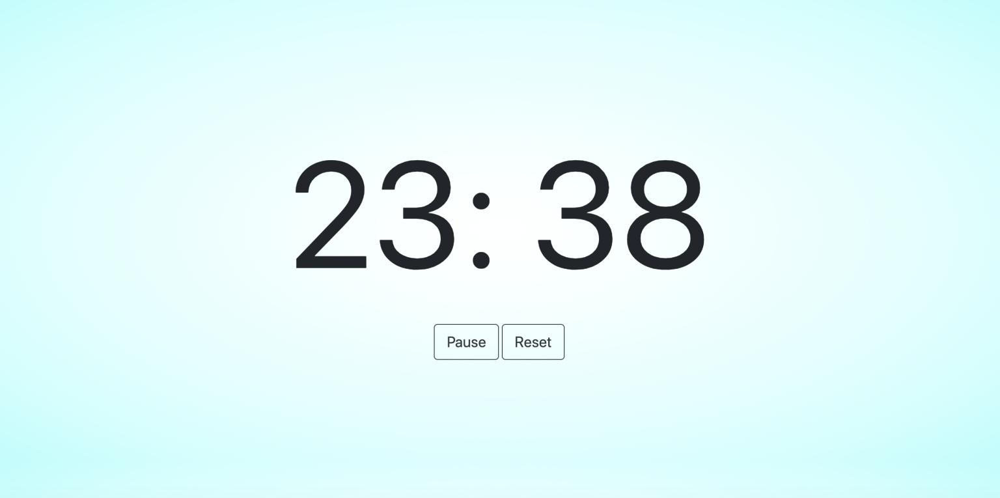

# Pomodoro

## Project Description
A web app Pomodoro clock that allows users to set session and break length.  Inspired from [florinpop17 / appideas ..Pomodoro-Clock](https://github.com/florinpop17/app-ideas/blob/master/Projects/1-Beginner/Pomodoro-Clock.md)

## Dependencies
* [GA Browser Template](https://git.generalassemb.ly/ga-wdi-boston/browser-template) - webpack for `require` system, build pipeline, and development server.
  - includes [Bootstrap](https://getbootstrap.com/docs/4.5/getting-started/introduction/) and [Handlebars.js](https://handlebarsjs.com/guide/)
* [npm](https://www.npmjs.com/): `npm install`

## User Stories
As a user I want to...
* set a time length for the working session and the break session
* see a timer countdown for both the working and break sessions
* start, pause, and reset the timers
* hear a sound when the timer runs out

## Future Goals
In future iterations of this project I would like to...
* add functionality so that the user can adjust the length of the study sessions and break sessions
* link in spotify(?) or otherwise allow the user choice of background music during sessions
* Add more styling to make the app more visually appealing
